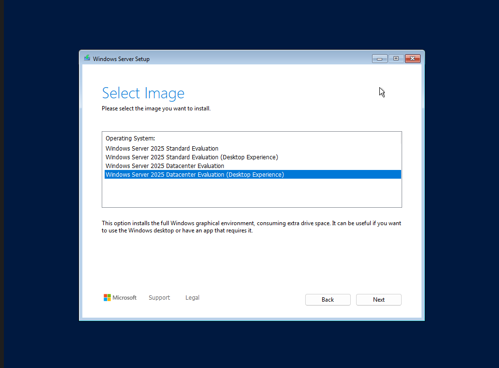
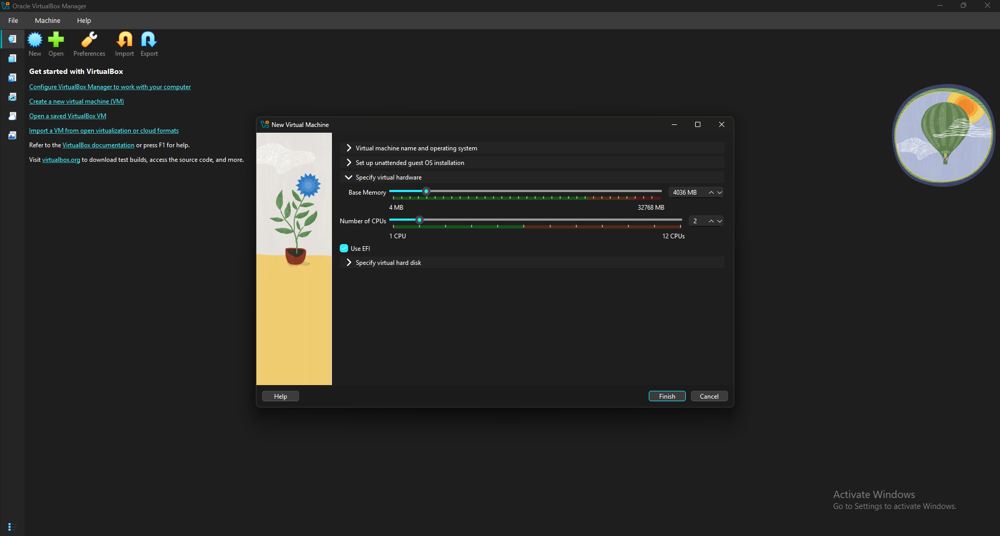
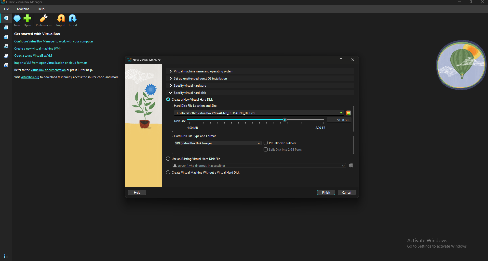
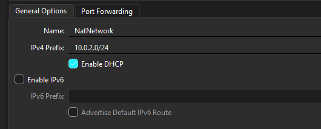
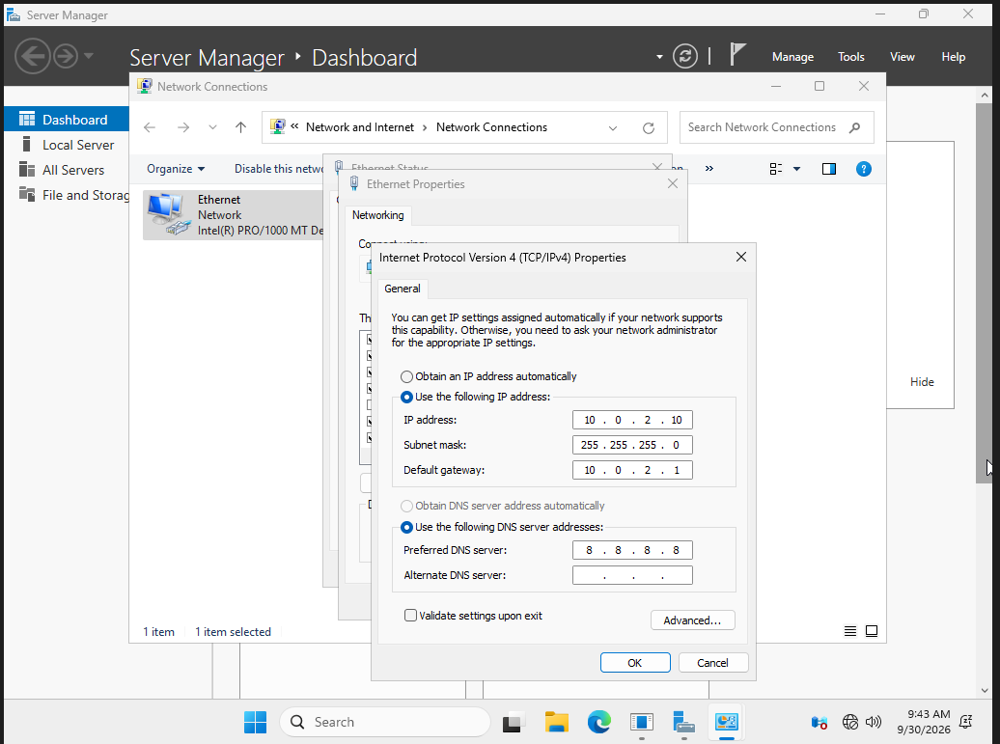
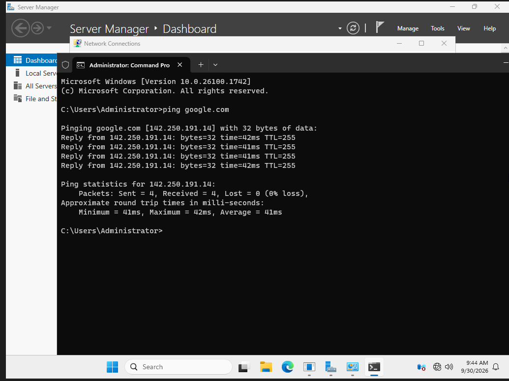
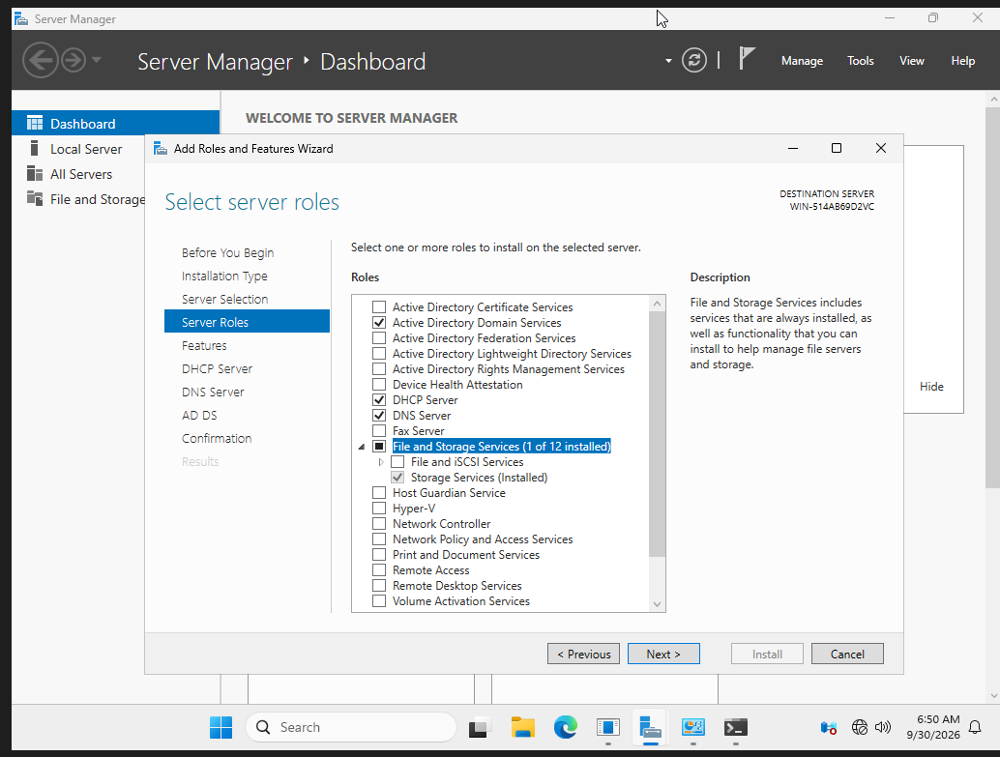
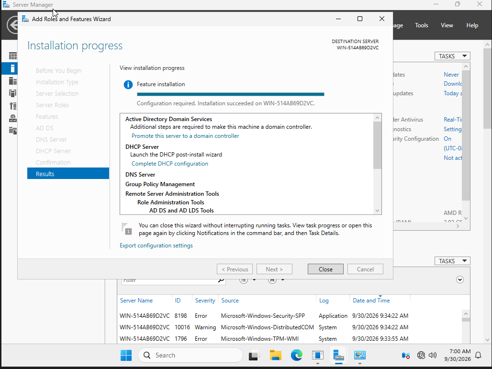
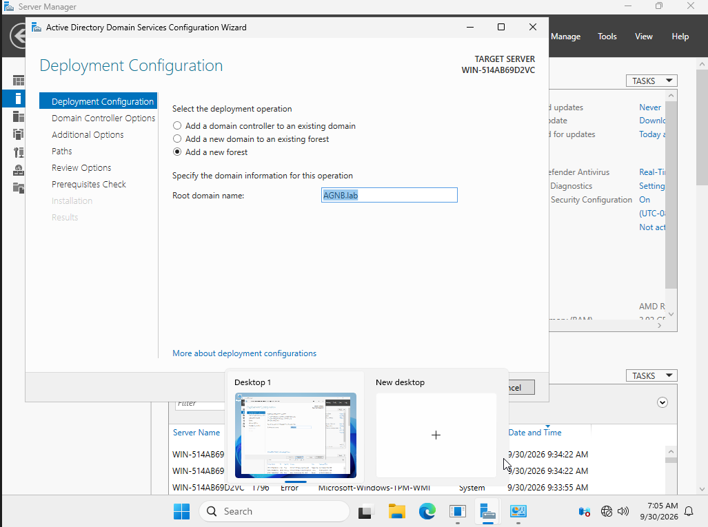
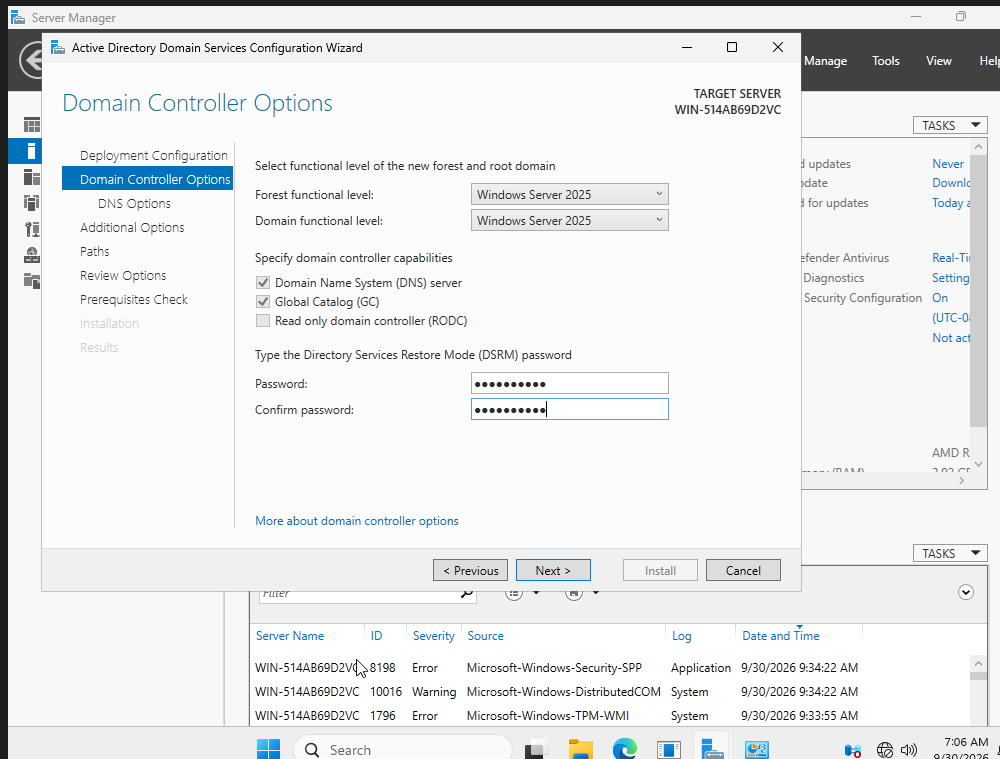

# VM Setup

- **Name:** AGNB_DC1
- **ISO:** Windows Server 2025
- **Edition:** Windows Server 2025 Datacenter Evaluation (Desktop Experience)

## Resources

- **Memory:** 4 GB
- **CPU:** 2 cores
- **Storage:** 50 GB

# Network

The VM is currently using a NAT Network, which allows connection to other VMs and the internet while keeping it separate from my host LAN.

## DC Network Configuration

- **IP address:** 10.0.2.10
- **Subnet mask:** 255.255.255.0
- **Default gateway:** 10.0.2.1
- **DNS:** 8.8.8.8

This configuration allows the server to connect to the internet, and allows clients to connect to the server without losing it due to the IP changing.

## Testing the Connection

Tested connectivity by pinging google.com.

# Installing Server Roles

## Active Directory Domain Services
- Provides management of users and computers within the domain, along with Group Policy to create rules for the domain.

## DNS
- The DNS role resolves hostnames to IP addresses for computers within the domain and allows clients to find the domain controller.

## DHCP
- The DHCP role allows the automatic configuration of devices that connect to the network.

After choosing the server roles, click through the rest of the options, then install and restart.

# Promoting the Server to Domain Controller

## Create a New Forest
- Promoted the server to the first DC in a new forest named **AGNB.lab**.
- This creates a whole new domain.

## Set the DSRM Password
- Set a DSRM (Directory Services Restore Mode) password.
- DSRM gives you access to recovery options in the case of corruption or server failure.

After setting the password, click through the rest of the options, then install and restart.

